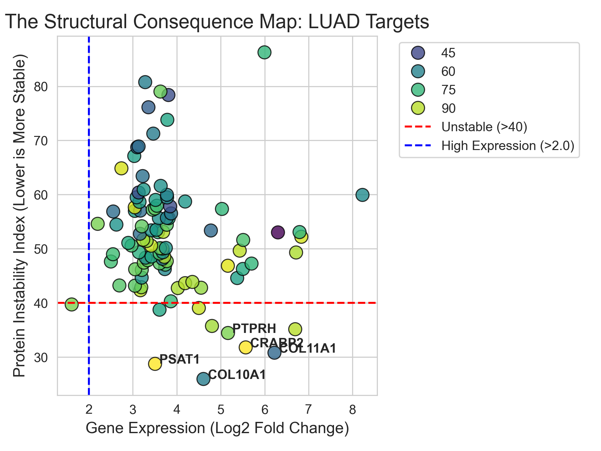
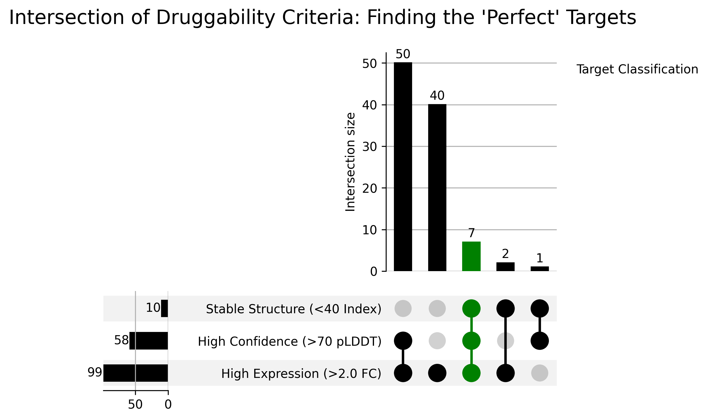

# LUAD Structural Consequence Pipeline: From Gene Expression to Druggability

## 🧬 Project Overview
This project integrates **Genomic Differential Expression** with **Structural Biology** to identify high-quality drug targets in Lung Adenocarcinoma (LUAD).

Standard RNA-seq analysis identifies which genes are upregulated in cancer, but not if they are viable drug targets. This pipeline bridges that gap by uses AlphaFold structures for top candidates and analyzing their biophysical stability to filter out "undruggable" false positives.

---

## 🎯 Biological Goal
**The Problem:** Many genes are statistically significant in cancer (high p-value) but structurally poor (disordered, fibrous, or unstable).
**The Solution:** We act as a "Structural Filter," removing candidates that are highly expressed but physically unsuitable for small-molecule drug binding.

**Criteria for a "Goldilocks Target":**
1.  **High Expression:** `Log2FoldChange > 2.0` (Tumor loves it).
2.  **Stable Structure:** `Instability Index < 40` (It holds a rigid shape).
3.  **High Confidence:** `pLDDT > 70` (AlphaFold model is reliable).

---

## 📊 Key Visualizations

### 1. The Structural Map (Volcano Plot)
This scatter plot maps gene expression (X-axis) against protein instability (Y-axis).
* **Target Zone:** Bottom-Right (High Expression + High Stability).
* **Winner:** `PSAT1` (Metabolic enzyme, rigid structure).
* **False Positive:** `COL10A1` (Matrix protein, disordered structure).



### 2. The Druggability Filter (UpSet Plot)
This chart visualizes the intersection of our three tiered criteria for a "Goldilocks Target." Out of thousands of differentially expressed genes, only **7** met all requirements for structural druggability.



---

## 🛠 Tech Stack & Pipeline

### Phase 1: Differential Expression (R)
* **Library:** `DESeq2`, `tidyverse`
* **Data:** TCGA-LUAD Raw Counts (Tumor vs. Normal).
* **Output:** List of top 5,000 statistically significant genes.

### Phase 2: Structural Retrieval (Python)
* **Library:** `requests`, `pandas`
* **API:** MyGene.info (ID mapping) & AlphaFold EBI Database.
* **Logic:** Smart fetching of PDB files with version handling and "Junk RNA" filtering.

### Phase 3: Biophysical Analysis (Python)
* **Library:** `BioPython`
* **Metrics:**
    * **pLDDT:** Confidence score extracted from B-factor columns.
    * **Instability Index:** Calculated based on amino acid dipeptide composition (Guruprasad method).

### Phase 4: Visualization (Python)
* **Library:** `seaborn`, `matplotlib`, `upsetplot`
* **Output:** Publication-ready figures merging genomic and structural data.

---

## 📂 Repository Structure

```text
├── data/                   # Raw inputs (PDB files, Counts matrix)
├── plots/                  # Generated figures
│   ├── structural_volcano.png
│   └── upset_consequence.png
├── results/                # CSV outputs
│   ├── phase1_targets.csv
│   └── structural_metrics.csv
├── scripts/                # Analysis Code
│   ├── 01_differential_expression.R
│   ├── 02_fetch_structures.py
│   ├── 03_analyze_structures.py
│   ├── 04_visualize_results.py
│   └── 05_upset_analysis.py
└── README.md
